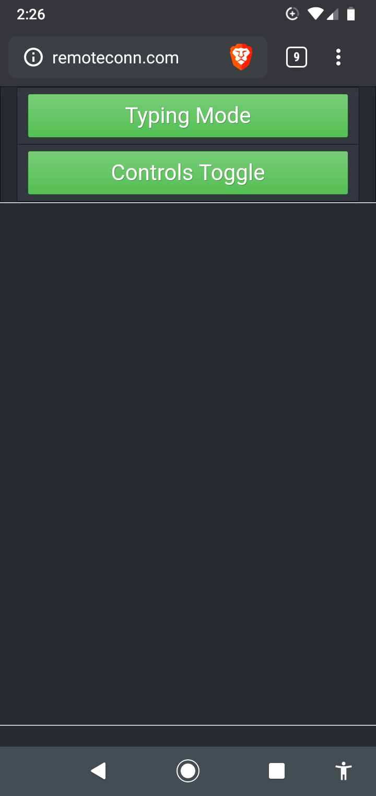

# Dropper
Remote Mouse is a flask + pyautogui app to control a PC from your phone or any other device.

# Notes
* Need python 2+
* Make sure to change the port in the start script as needed. Have fun!
* For Linux you will need to do sudo -i before running the script.

# Setup
*** Change directory to Remote-Mouse/ or rename the folder before doing so.

``` python3 -m venv venv/ ```

Linux/Mac
``` source bin/activate ```

Windows
``` source bin/Scripts/activate ```

Linux/Mac
``` pip install -r linux-requirements.txt ```

Windows
``` pip install -r windows-requirements.txt ```


``` cd src/ ```


Linux/Mac
``` ./linux-start.sh ```

Windows
``` ./windows-start.sh ```

# Images


# TODO
* Improve mouse translation and speed stepping...
* Cleanup code/logic.
